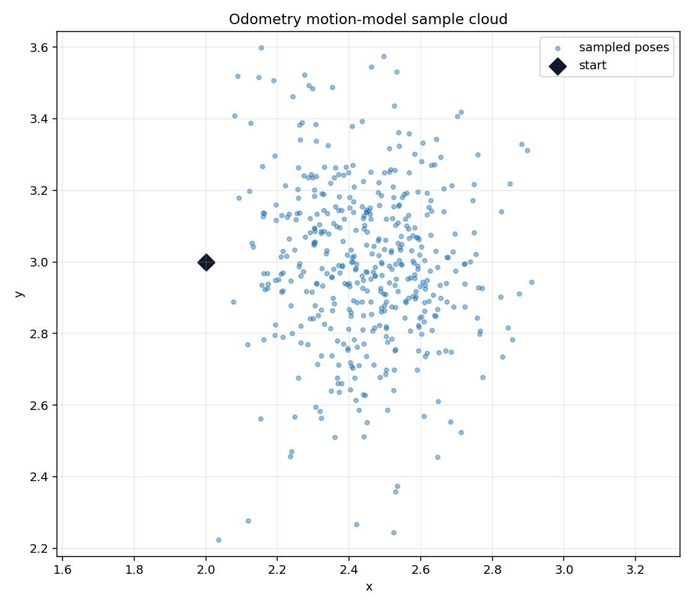

# Odometry Motion Model

Odometry-based probabilistic motion models from mobile robotics. The implementation covers inverse odometry, likelihood evaluation, posterior grid visualization, and sampling-based pose propagation.

## Run

```bash
python - <<'PY'
import numpy as np
import mobile_robotics_odometry_motion_model as odometry_motion_model

u = [[0.0, 0.0, 0.0], [0.5, 0.0, np.pi / 2]]
pose = [2.0, 3.0, 0.0]
alpha = [1.0, 1.0, 0.01, 0.01]
print(odometry_motion_model.sample_motion_model(pose, u, alpha))
PY
```

## Result screenshots



Sampled pose cloud from the odometry motion model.


## What this demonstrates

- Inverse odometry decomposition and noisy sample propagation.
- Likelihood evaluation for odometry-based motion updates.
- Visual intuition for how motion noise spreads pose hypotheses.


## Limitations and next steps

- The model is odometry-only and does not fuse observations.
- Noise parameters are example values rather than learned calibration.
- Next steps: add calibration from recorded odometry/ground-truth pairs.

